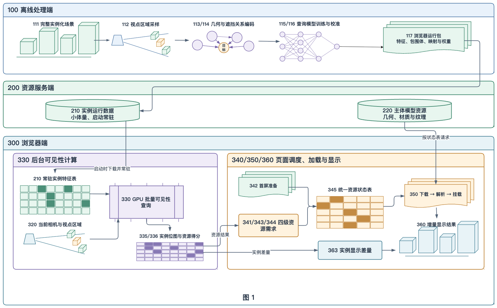
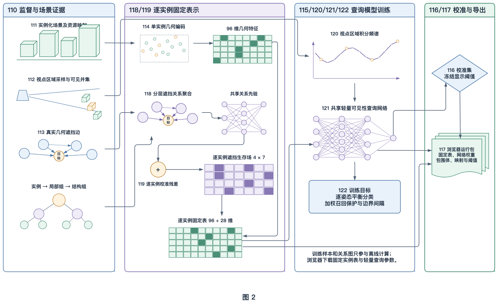
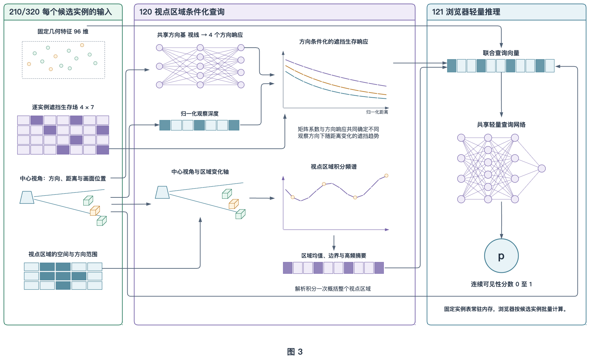
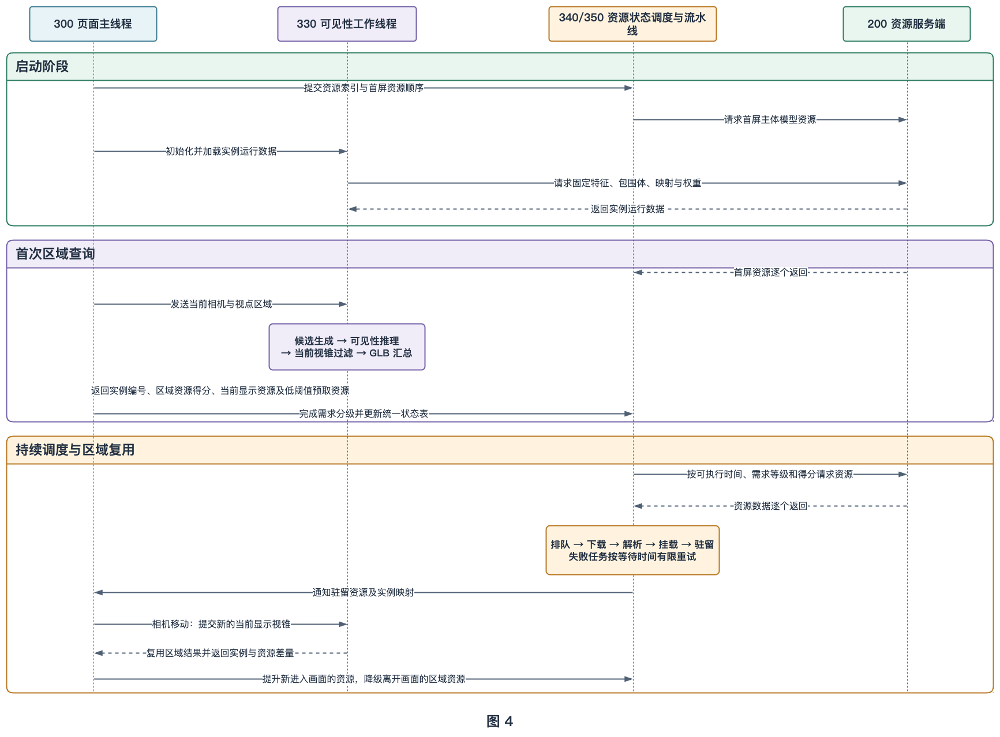
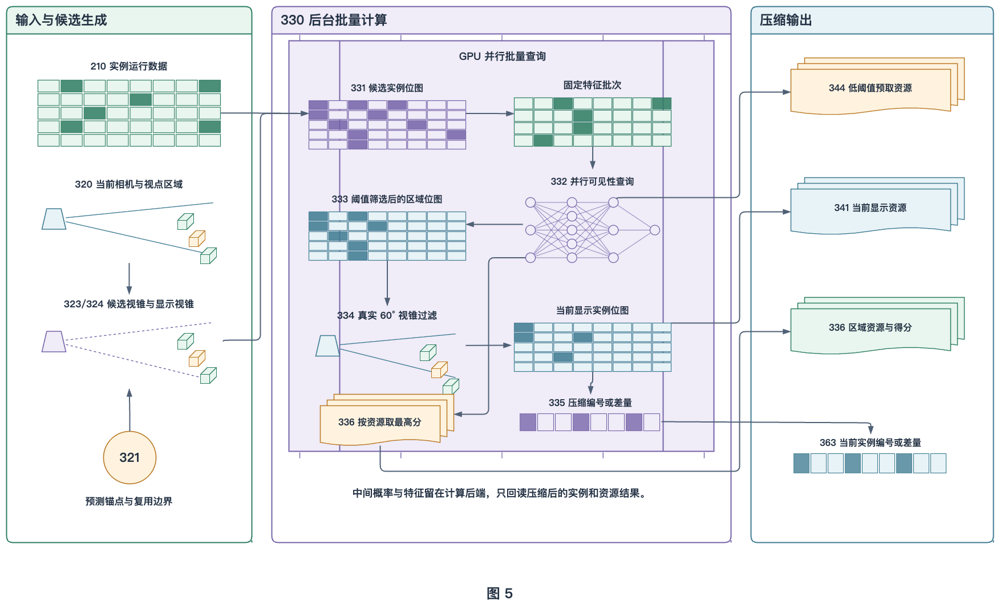
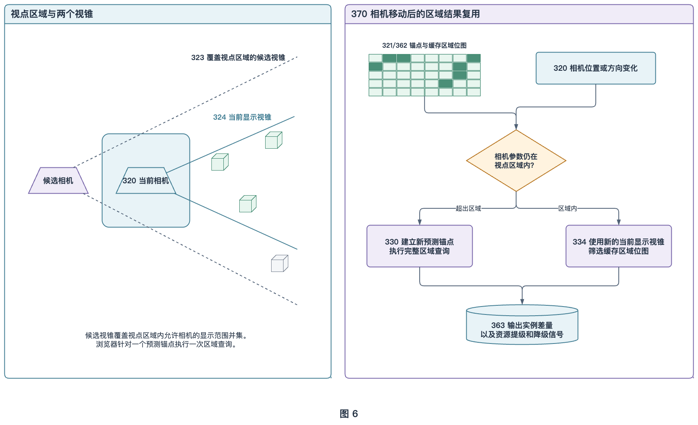
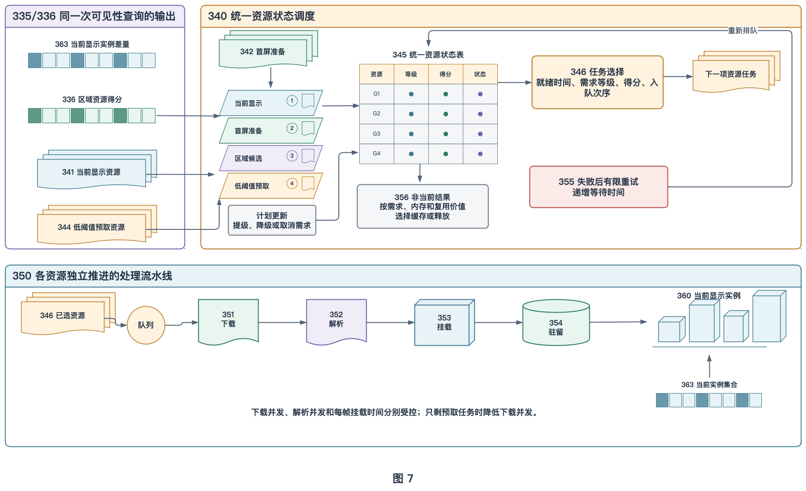
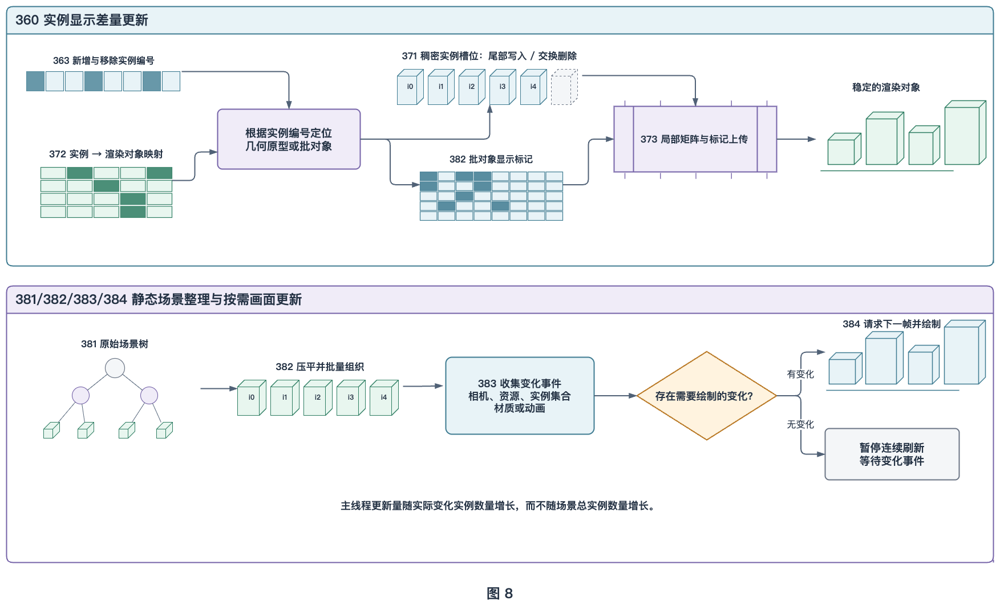

# 一种面向大规模三维场景的浏览器端区域可见性计算及实例资源流式调度与增量加载方法

## 摘要

本发明公开了一种面向大规模三维场景的浏览器端区域可见性计算及实例资源流式调度与增量加载方法。在主体模型资源容器尚未全部下载时，浏览器先获取与主体模型资源分开保存的实例运行数据，根据当前相机构造覆盖视点区域的候选视锥和对应当前画面的显示视锥，计算候选实例的连续可见性分数。同一次计算产生实例级显示结果、区域内资源得分、当前显示资源编号和低阈值预取资源编号。页面端将上述结果与首屏资源顺序及既有处理状态合并，在按资源标识去重的状态表中更新资源需求等级，并使各资源独立经过下载、解析和场景挂载。相机处于视点区域内时，浏览器复用区域结果并提升新进入画面的资源；相机越界时建立新的预测锚点。本发明以小型实例运行数据在模型下载前指导资源传输，并在资源挂载后继续实施实例级显示控制。

**摘要附图：图 1**



## 权利要求书

1. 一种面向大规模三维场景的浏览器端区域可见性计算及实例资源流式调度与增量加载方法，其特征在于，包括：

   在三维场景的至少一部分主体模型资源容器尚未下载的情况下，获取与所述主体模型资源容器分开存储的实例运行数据和资源容器索引，所述实例运行数据至少包括逐实例固定特征、逐实例包围体、实例到资源容器的映射以及视角条件化可见性查询参数；

   根据浏览器当前相机建立预测锚点和视点区域，并构造覆盖所述视点区域的候选视锥以及对应当前画面的当前显示视锥；

   根据所述逐实例包围体与所述候选视锥的相交结果确定候选实例，利用所述逐实例固定特征、所述当前相机相对于所述候选实例的方向和距离以及所述视点区域，计算所述候选实例的可见性分数；

   根据所述可见性分数形成区域可见实例集合，并使用所述当前显示视锥从所述区域可见实例集合中形成当前显示实例集合；

   根据所述实例到资源容器的映射，将所述实例的可见性分数汇总为资源容器优先级，并将所述资源容器优先级、所述当前显示实例集合、所述区域可见实例集合、首屏资源顺序以及资源容器的当前处理状态合并为资源处理计划；

   按资源标识维护统一资源状态表，在所述统一资源状态表中记录各资源容器的需求等级、资源容器优先级、处理状态和当前计划标记，并根据上述记录选择下一项可执行资源任务；

   按照所述资源处理计划，使资源容器依次经过分别具有处理预算的下载阶段、解析阶段和场景挂载阶段，任一资源容器完成前一阶段后进入下一阶段；

   所述资源容器完成场景挂载后，根据所述当前显示实例集合控制所述资源容器所对应实例的显示状态，并根据本次当前显示实例集合与上一次当前显示实例集合之间的差量更新发生变化的实例；

   当所述当前相机仍处于所述视点区域时，使用更新后的当前显示视锥重新筛选所述区域可见实例集合；当所述当前相机超出所述视点区域时，建立新的预测锚点并重新计算区域可见实例集合和资源容器优先级。

2. 根据权利要求 1 所述的方法，其特征在于，所述逐实例固定特征由离线提取的实例几何特征和实例遮挡关系特征组成；离线处理端根据目标实例与周围实例之间的前后遮挡关系、相对方向、相对距离和几何遮挡证据建立有向关系，并按照实例、局部组和结构组进行分层聚合，得到共享遮挡关系先验，再将所述共享遮挡关系先验与逐实例校准残差结合，形成按实例编号保存的方向和深度相关遮挡系数，使浏览器在未取得所述目标实例详细网格数据时能够查询该实例的遮挡变化规律。

3. 根据权利要求 1 所述的方法，其特征在于，所述视角条件化可见性查询由神经网络执行；浏览器根据相机到实例的单位方向、经实例尺寸归一化的距离以及视点区域的位置和方向范围，计算中心视角特征及其在所述视点区域内的变化轴，对预设频率下的视角响应进行区域积分，得到区域矩特征；所述神经网络以所述区域矩特征查询权利要求 2 所述的方向和深度相关遮挡系数，并联合实例几何特征输出所述实例在所述视点区域内的连续可见性分数。

4. 根据权利要求 1 所述的方法，其特征在于，所述候选视锥通过相对于所述当前相机扩大视场角、沿观察方向反向移动候选相机位置或组合采用上述方式得到，使所述候选视锥覆盖所述视点区域内允许相机对应的当前显示视锥范围。

5. 根据权利要求 1 所述的方法，其特征在于，候选视锥测试、可见性分数计算、阈值筛选、当前显示视锥测试、实例编号压缩和资源容器优先级汇总由浏览器提交的一个或多个图形处理器计算阶段完成，浏览器后台工作线程读取压缩后的实例结果和资源容器结果，而不读取候选实例的完整可见性分数数组。

6. 根据权利要求 1 所述的方法，其特征在于，所述资源容器的优先级根据映射至所述资源容器的一个或多个实例可见性分数的最大值确定；所述需求等级按照资源容器与当前显示实例、预定首屏资源、区域可见实例和达到预取阈值的候选实例之间的对应关系确定，同一需求等级内按照所述资源容器优先级排序。

7. 根据权利要求 1 所述的方法，其特征在于，所述资源容器按照资源容器级优先级下载、解析和缓存，所述资源容器完成场景挂载后，其中各实例分别根据所述当前显示实例集合确定显示状态，所述资源容器的加载状态不作为其中全部实例共同显示的条件。

8. 根据权利要求 1 所述的方法，其特征在于，所述区域可见实例集合与所述预测锚点关联保存；所述当前相机处于所述视点区域内时，对所述区域可见实例集合执行当前显示视锥重新筛选，并在浏览器后台工作线程中计算重新筛选前后实例集合和资源集合的差量，仅向浏览器主线程传送新增编号和移除编号。

9. 根据权利要求 1 所述的方法，其特征在于，所述统一资源状态表按资源标识对资源容器去重，并为每个资源容器记录排队、下载、解析、挂载、驻留或失败状态；当资源容器的需求等级改变时，在保持其当前处理状态的情况下更新处理顺序，使正在处理或者已经完成相应阶段的资源继续使用已有结果。

10. 根据权利要求 1 所述的方法，其特征在于，浏览器根据预先保存的首屏资源顺序选择限定数量的资源容器，将其作为首屏准备需求写入所述统一资源状态表，并与所述逐实例固定特征和所述视角条件化可见性查询参数的加载并行执行；所述资源容器内部实例仍根据所述当前显示实例集合确定显示状态。

11. 根据权利要求 1 所述的方法，其特征在于，所述下载阶段限制并发请求数量或在途数据量，所述解析阶段限制并发解析数量或待解析数据量，所述场景挂载阶段限制一次事件循环或一帧内的处理时间，任一资源容器完成当前阶段后独立进入下一阶段；当待处理任务仅包含预取需求时，采用低于当前显示需求或首屏准备需求存在时的下载并发预算。

12. 根据权利要求 1 所述的方法，其特征在于，为资源处理计划维护递增的计划序号，并在所述统一资源状态表中记录资源容器是否仍为当前计划所需；所述资源处理计划改变后，未开始且不再需要的任务从待处理集合移除，已经开始的任务在阶段完成时根据当前需求、内存占用、资源优先级或画面投影范围选择进入下一阶段、保存为可复用缓存或丢弃，且不把不属于当前场景的结果挂载至当前场景。

13. 根据权利要求 1 所述的方法，其特征在于，实例化网格的活跃实例矩阵存储在连续槽位中，删除非尾部槽位对应实例时使用尾部槽位的实例矩阵覆盖待删除槽位，并更新源实例编号与槽位之间的映射，使图形处理器更新的数据范围对应于新增槽位和发生覆盖的槽位。

14. 根据权利要求 1 所述的方法，其特征在于，对静态网格固化世界变换，并根据材质和顶点数据布局将兼容网格加入批量渲染对象；在相机、实例集合、资源挂载、材质和动画均无变化时暂停连续画面请求，在上述任一状态发生变化时请求画面更新。

15. 一种面向大规模三维场景的浏览器端区域可见性计算及实例资源流式调度与增量加载系统，其特征在于，包括：

   实例运行数据模块，用于在主体模型资源容器尚未全部下载时，提供与所述主体模型资源容器分开存储的逐实例固定特征、逐实例包围体、实例到资源容器的映射和视角条件化可见性查询参数；

   相机与视点区域模块，用于建立预测锚点、视点区域、候选视锥和当前显示视锥；

   区域可见性计算模块，用于确定候选实例、计算实例可见性分数并形成区域可见实例集合和当前显示实例集合；

   资源状态调度模块，用于将所述实例可见性分数汇总为资源容器优先级，将当前显示需求、首屏准备需求、区域候选需求和低阈值预取需求写入按资源标识去重的统一资源状态表，并根据需求等级、资源容器优先级、处理状态和当前计划标记选择资源任务；

   资源处理流水线，用于按照所述资源容器优先级和处理预算分别控制资源下载、解析和场景挂载；

   实例显示模块，用于在资源容器完成场景挂载后，根据所述当前显示实例集合及其差量更新实例显示状态；

   区域复用模块，用于在当前相机处于所述视点区域内时重新筛选所述区域可见实例集合，并在当前相机超出所述视点区域时触发新的区域可见性计算。

16. 一种电子设备，包括至少一个处理器、存储器和网络通信接口，所述存储器中存储有计算机程序，所述计算机程序被所述至少一个处理器执行时，实现权利要求 1 至 14 任一项所述的方法。

17. 一种计算机可读存储介质，其上存储有计算机程序，所述计算机程序被处理器执行时，实现权利要求 1 至 14 任一项所述的方法。

## 说明书

### 技术领域

本发明涉及计算机图形学、浏览器三维应用和网络资源加载技术领域，具体涉及一种在浏览器端计算大规模三维场景的区域可见性，并根据计算结果对实例模型资源进行流式调度、下载、解析、场景挂载和增量显示的方法、系统、电子设备及计算机可读存储介质。

### 背景技术

建筑信息模型、数字孪生工厂、园区模型和城市级三维场景通常由数量较多的构件组成。为了便于传输和复用，场景数据通常被划分为多个模型资源文件；同一个资源文件可以包含多个构件，同一个几何模型也可以通过不同的空间变换在场景中形成多个实例。浏览器需要通过网络取得这些资源，完成数据解码和场景对象创建后，才能显示相应内容。

当场景规模超过浏览器能够一次性快速下载和处理的范围时，通常需要按照相机位置逐步加载资源。常用方法可以根据资源与相机的距离、资源所在空间块或者包围体是否与相机视锥相交来决定加载顺序。这些方法能够排除位于观察方向之外的对象，但对于处在视锥内且被其他建筑或构件遮挡的对象，仍可能提前下载和解析较多暂时不会出现在画面中的资源。

浏览器也可以通过深度缓冲、遮挡查询或详细几何投影判断对象是否被遮挡。这类方法需要在运行时维护遮挡几何并持续执行投影或深度比较。对于包含大量实例的场景，相关计算、数据传输和查询结果处理会占用图形处理器、中央处理器和主线程时间，移动设备上的资源限制更加明显。

上述基于深度或详细几何的遮挡判断通常要求浏览器已经取得遮挡物的几何数据，并取得被判断构件的包围体、投影代理或详细形状数据。在场景没有单独提供这些代理数据的情况下，浏览器需要先下载和解析相应主体模型，才能利用其中的网格建立深度缓冲、执行遮挡查询或者进行几何投影。尚未下载的构件及其周围遮挡物不能提供完成该类判断所需的形状信息。

如果为了进行遮挡剔除而预先下载全部模型资源，则场景的主要网络传输时间、模型解析时间和内存占用已经发生。此时遮挡剔除可以减少后续绘制工作，但难以减少首屏阶段和视点切换阶段的模型下载量。对于模型文件较大、资源数量较多且依赖网络传输的 Web 三维场景，先取得完整模型再决定其是否需要加载的处理顺序难以满足快速展示和按需传输要求。

因此，在浏览器尚未取得主体模型几何时，需要有一份能够独立下载、数据量较小且足以支持可见性判断的实例运行数据。浏览器可先利用该数据估计当前视点区域内的遮挡和可见关系，再把判断结果用于选择主体模型资源及安排其下载顺序。这样，可见性计算既用于加载后的实例显示控制，也用于加载前的资源调度。

场景资源的下载单位与画面显示单位往往不同。网络请求通常以一个完整模型文件为单位，可见性控制则需要精确到文件内部的实例。资源文件与实例之间需要建立明确映射，使浏览器能够按完整资源文件传输和缓存，并在文件内部逐实例控制显示。

资源取得后还需要经过下载数据接收、模型解析、纹理和网格准备以及场景挂载等步骤。如果这些步骤在一批资源全部下载后集中执行，容易造成较长的首屏等待和瞬时主线程负载。相机移动还会使资源需求不断变化，已经开始的旧请求和旧解析结果可能晚于当前计划完成，需要避免失效结果进入当前场景。

相机在相邻位置连续移动时，其潜在可见集合通常具有较强连续性。视点区域可以覆盖相机在附近空间内的移动，并允许浏览器在该区域内复用一次完整预测的结果。

基于上述情况，需要一种面向大规模三维场景的浏览器端处理方法，使浏览器在主体模型资源尚未全部下载时即可利用小型实例运行数据完成区域可见性计算，并以该结果安排后续模型资源的下载、解析和挂载顺序，在资源到达后继续保持实例级显示控制和增量场景更新。

### 发明内容

#### 要解决的技术问题

本发明的目的在于提供一种区域可见性驱动的实例资源流式调度与增量加载方法，使浏览器在主体模型资源尚未全部下载和解析时，能够先利用数据量较小的实例运行数据计算当前视点区域内可能可见的实例，并将计算结果直接用于选择模型资源、安排资源处理顺序以及控制资源加载后的实例显示。

本发明主要解决以下相互关联的技术问题：

1. 在主体模型资源尚未下载时，利用与主体模型分开保存的小型实例运行数据获得当前视点区域内的实例可见性结果；
2. 将离线完成的复杂场景关系分析压缩到逐实例固定特征中，使浏览器无需预先取得构件详细网格即可执行轻量可见性查询；
3. 将实例级可见性结果转换为资源容器级优先级，使下载粒度与显示粒度保持各自适合的尺度；
4. 减少大规模候选结果在图形处理器、后台工作线程和浏览器主线程之间的传输与重复整理；
5. 在相机小范围移动时复用区域结果，并在超出复用范围后及时重新计算；
6. 使资源按照当前需求依次完成下载、解析和场景挂载，且能够在处理过程中调整优先级；
7. 当资源需求或可见实例集合变化时，仅更新变化部分，并保证较早发起但已经失效的异步任务不会改变当前场景；
8. 在资源持续到达的过程中控制解析和挂载负载，使浏览器交互和画面更新保持稳定。

#### 术语说明

为使下文中的数据对象和处理步骤含义一致，对相关术语说明如下。

##### 大规模三维场景

大规模三维场景是指包含较多实例、几何数据或资源文件，以至于不宜在页面初始化时一次性完成全部下载、解析和显示的三维场景。其可以是建筑、工厂、园区、城市、基础设施或其他由多个三维对象组成的场景。本发明不以固定实例数量或固定文件大小作为“大规模”的唯一判断标准。

##### 几何原型与实例

几何原型是可被复用的网格、材质及相关模型数据。实例是几何原型在场景中的一次具体使用，具有自己的实例编号、空间变换和显示状态。多个实例可以共享一个几何原型，也可以由不同几何原型构成。本发明以实例作为可见性判断和显示控制的基本单位。

##### 资源容器

资源容器是网络请求、数据解析和缓存管理的基本单位，可以是二进制 glTF 模型文件、三维瓦片内容、压缩网格数据包或者其他能够独立传输和解析的三维资源。二进制 glTF 模型文件通常使用 GLB 扩展名，下文在具体实施例中以 GLB 文件作为资源容器示例。

##### 实例到资源容器的映射

实例到资源容器的映射用于记录取得某个实例的几何和材质数据需要加载哪个资源容器。以 `m(i)=g` 表示实例 `i` 由资源容器 `g` 提供。一个资源容器可以对应一个或多个实例，多个实例也可以通过同一资源容器中的几何原型实现复用。

##### 视点区域与预测锚点

视点区域是允许复用一次区域可见性计算结果的相机活动范围。该范围可以同时约束相机位置、观察方向、视场角和画面宽高比。预测锚点是执行完整区域可见性计算时所采用的基准相机状态，用于判断后续相机是否仍处于对应视点区域。预测锚点是本方案中的状态记录，不表示场景中存在实体锚点。

离线生成训练数据时，可以在一个视点区域内设置多个采样相机，以取得该区域内可能可见实例的并集。浏览器运行时不需要再次遍历这些采样相机，而是根据当前预测锚点执行一次区域查询。

##### 候选视锥与当前显示视锥

视锥是由相机位置、观察方向、视场角、宽高比以及近远裁剪距离确定的可观察空间。候选视锥用于覆盖视点区域内可能进入画面的实例，其覆盖范围通常大于当前相机的显示范围。当前显示视锥对应浏览器当前画面实际能够观察到的空间。

候选视锥可以通过扩大当前相机视场角、沿观察方向反向移动候选相机或者组合采用上述方式生成。候选视锥负责形成保守的查询范围，当前显示视锥负责从区域结果中选出当前画面所需实例。

##### 实例包围体

实例包围体是包围实例几何的简化空间范围，用于快速判断实例是否与视锥相交。具体实施例使用与世界坐标轴平行的长方体包围盒，即轴对齐包围盒。包围体仅用于候选生成和当前显示范围过滤，不作为实例之间精细遮挡关系的唯一判断依据。

##### 固定实例特征与视角条件化查询

固定实例特征是离线生成并按实例编号保存的紧凑数据，用于描述实例几何以及该实例与周围场景之间的遮挡关系。该特征与当前浏览器相机状态无关，因此可以随场景资产预先生成并在不同视点查询中重复使用。

视角条件化查询是指把固定实例特征与当前相机相对该实例的方向、距离及视点区域描述共同输入可见性查询模型，得到该实例的可见性分数。在优选实施方式中，可见性查询模型采用轻量神经网络。可见性分数表示实例在对应视点区域内进入画面的可能程度，分数越高表示越应优先保留。资源调度模块再根据该分数和实例到资源容器的映射生成资源处理优先级。

本文将固定实例特征、实例包围体、实例到资源容器的映射、查询参数和相关说明信息统称为实例运行数据。实例运行数据与包含详细网格、材质和纹理的主体模型资源分开存储，其数据量小于主体模型资源，并能够在主体模型资源下载前由浏览器取得。实例运行数据用于下载前的可见性计算和资源调度，不直接承担最终模型画面的显示。

##### 区域可见实例集合与当前显示实例集合

区域可见实例集合是根据候选视锥和可见性分数得到的、在整个视点区域内可能进入画面的实例集合。当前显示实例集合是在区域可见实例集合基础上，再与当前显示视锥相交得到的实例集合。区域可见实例集合用于区域复用和资源预取，当前显示实例集合用于画面显示和当前显示资源识别。

##### 资源流式调度与增量加载

资源流式调度是指浏览器把可见性查询结果、首屏资源顺序和资源当前状态合并到统一资源状态表，再持续安排网络下载、数据解析和场景挂载。统一资源状态表以资源标识作为唯一键，记录需求等级、可见性得分、处理状态、重试时间和当前计划标记。增量加载是指各资源独立推进，任一资源完成当前阶段后即可进入下一阶段。

本文所称场景挂载，是指将已经解析的网格、材质、纹理、实例映射等对象登记到浏览器场景和运行状态中，使其能够被后续显示控制使用。资源已经挂载不代表其中全部实例立即显示。

##### 资源需求等级

资源需求等级表示同一时刻不同资源容器的处理紧迫程度。一项实施方式设置当前显示需求、首屏准备需求、区域候选需求和低阈值预取需求。当前显示需求来自当前显示实例集合；首屏准备需求来自部署前生成的首屏资源顺序；区域候选需求来自区域可见性结果中尚未进入当前画面的资源；低阈值预取需求来自达到预取阈值但尚未达到显示阈值的候选实例。需求等级用于决定处理先后，不改变实例可见性分数及当前显示实例集合。

##### 有界处理流水线

有界处理流水线是指下载、解析和场景挂载三个阶段分别设置并发数量、待处理数据量、内存占用或单次处理时间上限。这里的“有界”表示各阶段按照预定资源预算运行，用于避免多个大资源同时处理造成浏览器长时间阻塞。

##### 集合差量与位图

集合差量是新旧实例集合之间新增项和移除项的集合。位图是一种以一个二进制位表示一个实例编号或资源编号是否属于集合的数据结构。使用位图可以在后台工作线程中比较新旧集合，并只向主线程传递发生变化的编号。位图是优选实现，也可以采用有序编号表或其他能够计算集合差量的数据结构。

#### 技术方案

##### 系统组成和总体流程

本发明的一种实施系统包括离线处理端、资源服务端和浏览器端。离线处理端用于整理场景实例、生成可见性训练数据、提取固定实例特征以及导出查询参数。资源服务端用于提供实例运行数据和三维资源容器。浏览器端至少包括相机状态模块、区域可见性计算模块、资源调度模块、资源处理流水线和实例显示模块。

浏览器端可以将区域可见性计算放在浏览器后台工作线程中执行。后台工作线程是独立于页面主线程的脚本执行环境，适合承担数据准备、图形处理器任务提交和集合差量计算。页面主线程主要负责用户交互、资源解析结果登记和场景显示更新。

本方法可以依次包括以下步骤：

1. 对大规模三维场景建立实例编号、资源容器编号及二者之间的映射，离线生成固定实例特征、实例包围体和视角条件化查询参数；
2. 在主体模型资源尚未全部下载的情况下，浏览器先加载上述实例运行数据、资源索引和预定的初始资源顺序；
3. 根据当前相机建立预测锚点、视点区域、候选视锥和当前显示视锥；
4. 在不依赖目标构件详细网格的情况下确定候选实例，计算候选实例的可见性分数，并生成区域可见实例集合和当前显示实例集合；
5. 根据实例到资源容器的映射，将实例可见性分数汇总为资源容器优先级；
6. 将资源容器优先级、当前显示资源编号、区域候选资源、低阈值预取资源、首屏资源顺序和资源当前状态写入统一资源状态表，形成资源处理计划；
7. 按照队列顺序和各阶段处理预算，依次执行资源下载、解析和场景挂载；
8. 根据当前显示实例集合的变化，仅更新新增实例和移除实例的显示状态；
9. 相机仍处于对应视点区域时，复用区域可见实例集合并根据最新当前显示视锥更新当前显示实例集合；
10. 相机离开视点区域或者相机参数超出复用条件时，建立新的预测锚点并重新执行步骤 3 至步骤 6；资源处理计划更新时，已经下载或解析的数据根据当前需求和缓存条件继续复用。

##### 离线实例运行数据生成

离线处理端首先读取场景资源和实例变换，建立稳定的实例编号与资源容器编号。对于每个实例，计算其世界坐标下的包围体，并记录其所使用的资源容器、几何原型和空间变换。

随后，在场景中设置多个视点区域。每个视点区域可以包含多个离线采样相机，用于收集从该区域内不同合法位置观察时可能进入画面的实例。采样得到的可见实例并集作为区域可见性监督信息。训练数据还可以包括相机到实例的方向、距离、实例可见面积或者其他能够反映可见程度的信息。

离线特征生成过程对实例自身几何和场景关系进行分析。实例自身几何可以包括尺寸、形状、表面分布和空间位置。场景关系可以包括目标实例与周围实例之间的相对方向、相对距离和由真实几何观察得到的遮挡证据。上述信息经编码和压缩后形成固定长度的实例特征。固定特征按实例编号连续保存，供浏览器直接索引。

离线处理端利用视点区域样本训练视角条件化可见性查询神经网络。该神经网络接收目标实例的固定特征、相机相对目标实例的方向和距离以及视点区域范围，输出一个连续可见性分数。实例点云编码、实例关系分析和遮挡特征生成在离线阶段完成；浏览器运行时仅对候选实例执行已经训练完成的神经网络前向计算。神经网络的具体层数、隐藏层宽度和激活函数可以根据运行设备的计算预算确定。训练完成后，在与训练样本分开的校准数据上确定显示阈值和可选的预取阈值。

最终导出的实例运行数据至少包括：

- 固定实例特征表；
- 实例包围体表；
- 实例到资源容器的映射表；
- 可见性查询参数和阈值；
- 视点区域描述所需的查询辅助参数；
- 资源容器索引；
- 数据结构版本、实例数量、特征维度及适用相机范围等说明信息。

原始训练点云、离线遮挡采样图像和场景关系计算过程不属于浏览器运行时输入。浏览器取得的是已经生成的固定实例特征和轻量查询参数。

##### 浏览器初始化与首屏资源并行准备

浏览器启动后读取资源容器索引、实例运行数据和可选的初始资源顺序。资源容器索引至少记录资源编号、资源地址以及该资源与实例之间的对应关系，还可以记录资源字节数、压缩方式和解析类型。

实例运行数据与主体模型资源采用独立请求。浏览器无需等待场景主体模型下载和解析，即可利用固定实例特征、包围体和资源映射执行首次区域可见性计算。首次计算得到的资源容器优先级用于决定后续主体模型资源的请求顺序，从而使遮挡判断发生在目标模型资源下载之前。

初始资源顺序可以在部署前根据默认相机计算，也可以由历史访问数据或场景配置给出。浏览器从该顺序中选择前若干个资源发起预加载，同时加载固定实例特征和可见性查询参数。首屏资源请求和实例运行数据请求并行进行。预加载阶段取得的资源进入缓存和后续处理流水线，其内部实例仍由当前显示实例集合控制。

浏览器在使用实例运行数据前，检查数据结构版本、实例数量、特征维度、资源映射范围和数值有效性。检查不通过时，不使用不匹配的可见性结果控制当前场景。

##### 预测锚点、视点区域和两个视锥的建立

浏览器以当前相机状态建立预测锚点。视点区域由相对于该锚点允许的位置偏移、方向偏移、视场角变化和画面宽高比变化共同确定。不同场景可以根据道路宽度、建筑间距、室内空间尺寸或交互速度采用不同的区域范围。

当前显示视锥由浏览器当前相机直接确定。候选视锥用于覆盖视点区域内各合法相机可能观察到的空间。为了取得该覆盖范围，可以扩大候选相机的视场角、沿观察方向反向移动候选相机，或者同时调整视场角和位置。候选视锥应覆盖视点区域内允许相机对应的显示视锥并集。

候选视锥的作用是快速排除在整个视点区域内均不可能进入画面的实例。当前显示视锥的作用是从区域可见实例中确定当前画面所需实例。两个视锥具有不同职责，浏览器每次完整预测只提交一个候选实例批次，不在运行时遍历离线采样使用的多个相机。

##### 区域可见性分数与实例集合

对于实例 `i`，以 `x_i` 表示固定实例特征，以 `q_i` 表示由当前相机与实例之间的方向和距离形成的查询量，以 `v` 表示视点区域范围，以 `f` 表示离线训练并导出的查询模型，则实例可见性分数可以表示为：

```text
s_i = f(x_i, q_i, v)
```

以 `B_i` 表示实例包围体，以 `F_c` 表示候选视锥，候选实例集合为：

```text
C = { i | B_i 与 F_c 相交 }
```

以 `tau` 表示离线校准得到的显示阈值，区域可见实例集合为：

```text
P_region = { i | i 属于 C 且 s_i 不小于 tau }
```

以 `F_d` 表示当前显示视锥，当前显示实例集合为：

```text
P_display = { i | i 属于 P_region 且 B_i 与 F_d 相交 }
```

可见性分数用于表示实例相对于当前视点区域的保留优先程度。显示阈值用于形成需要保守保留的实例集合。为了提前准备相机即将需要的资源，还可以设置不高于显示阈值的预取阈值，使部分尚未进入显示集合但具有一定可见可能性的实例参与资源预取。

##### 图形处理器中的连续可见性计算

在优选实施方式中，浏览器通过 WebGPU 或具有等同通用计算能力的浏览器图形接口，把固定实例特征、实例包围体、实例到资源容器的映射和相机参数提交给图形处理器。WebGPU 是浏览器用于访问图形处理器计算能力的接口，本发明利用其批量并行处理实例数据。

图形处理器按照实例编号执行以下操作：

1. 判断实例包围体是否与候选视锥相交；
2. 对相交实例构造方向、距离和区域查询量；
3. 根据固定实例特征和查询参数计算可见性分数；
4. 根据显示阈值生成区域可见实例标记；
5. 对区域可见实例继续执行当前显示视锥测试，生成当前显示实例标记；
6. 根据实例到资源容器的映射，把实例分数汇总到对应资源容器；
7. 将区域实例编号、当前显示实例编号和资源容器编号分别压缩为连续输出。

上述步骤可以由一个或多个连续的图形处理器计算阶段完成。中间的候选实例分数、临时特征和逐实例测试结果保留在图形处理器内。正常运行时，浏览器后台工作线程只读取压缩后的实例编号、资源编号、资源优先级或者集合差量，不读取全部候选实例的概率数组。

##### 实例显示与资源调度的双粒度输出

同一次区域可见性计算至少产生以下两类结果：

1. 实例级输出，包括区域可见实例集合和当前显示实例集合，用于实例显示控制和区域结果复用；
2. 资源容器级结果，包括区域内资源编号及其优先级、当前显示资源编号以及低阈值预取资源编号，用于形成资源需求等级。

对于资源容器 `g`，一种优先级计算方式是取映射到该资源容器的相关实例可见性分数最大值：

```text
priority(g) = max { s_i | m(i)=g 且 i 属于参与调度的实例集合 }
```

参与调度的实例集合可以是当前显示实例、区域可见实例或者达到预取阈值的候选实例。区域可见性计算模块保留这些集合各自的来源，页面端据此确定当前显示需求、区域候选需求和低阈值预取需求；首屏资源顺序形成首屏准备需求。同一需求等级内按照聚合分数排序，资源字节数、缓存状态和预计解析时间可以作为附加排序条件。

资源容器完成下载和挂载后，其状态变为可供实例使用。实例显示模块仍按照当前显示实例集合逐实例控制显示。由此，一个资源容器中的某个实例需要显示时可以促使整个资源提前加载，但同一资源中的其他实例不会因此自动进入当前显示集合。

##### 视点区域内的结果复用与重新筛选

完整区域可见性计算结束后，系统保存区域可见实例集合、区域内资源得分和对应预测锚点。相机发生变化时，首先判断新相机是否仍满足该预测锚点的区域范围。

在满足复用条件时，系统使用最新当前显示视锥重新筛选已缓存的区域可见实例，得到新的当前显示实例集合。系统同时把新进入当前显示视锥的资源提升为当前显示需求，把离开当前显示视锥但仍处于区域结果中的资源降为区域候选需求，并计算新旧实例集合和资源集合的差量。

相机位置、观察方向、视场角或者宽高比超出对应区域范围时，原区域结果不再复用。系统以新相机建立预测锚点，重新生成候选视锥并执行完整区域可见性计算。

重新筛选可以继续在图形处理器中执行。区域实例集合以位图或压缩编号保留时，后台工作线程只需取得新增和移除编号，页面主线程无需为每次小范围相机移动重新构造完整实例数组。

##### 统一资源状态调度

资源状态调度模块按资源标识建立统一资源状态表。每条记录至少包含资源容器编号、需求等级、聚合可见性分数、处理状态、是否属于当前计划、进入调度的先后次序以及失败后的再次可执行时间。处理状态包括排队、下载、解析、挂载、驻留和失败。一个资源标识在状态表中只有一条记录，下载、解析和挂载阶段围绕该记录推进。

调度模块先检查失败重试等待时间，再比较需求等级和聚合可见性分数；条件相同时，可以按照进入调度的先后次序选择下一项任务。首屏准备资源在可见性运行数据初始化期间参与调度。首次区域查询完成后，当前显示需求优先于区域候选需求和低阈值预取需求。

相机移动使资源进入当前显示范围时，调度模块直接提高该资源在当前阶段的处理顺序。资源离开当前显示范围但仍属于区域结果时，调度模块把需求等级降为区域候选。正在下载、解析或挂载的任务继续使用原有数据，不另建同类任务；驻留资源可以直接供实例显示模块使用。失败任务按照有限次数和递增等待时间重新进入排队状态。

##### 下载、解析和场景挂载的有界流水线

资源处理流水线包括相互衔接的下载阶段、解析阶段和场景挂载阶段：

1. 下载阶段按照资源需求类别和优先级发起网络请求，将响应数据保存为待解析数据，并记录请求状态；
2. 解析阶段把待解析数据转换为网格、材质、纹理、实例信息及相应的浏览器场景对象；
3. 场景挂载阶段把解析结果登记到场景、资源缓存和实例映射中，使当前需要的实例能够显示。

三个阶段分别采用处理预算。下载阶段可以限制并发请求数量和在途字节数；解析阶段可以限制同时解析的资源数量和待解析数据总量；场景挂载阶段可以限制一次事件循环或一帧内允许使用的处理时间。浏览器可以根据设备性能、网络状况和近期帧耗时调整预算。当状态表中只剩区域候选需求或低阈值预取需求时，下载阶段可以降低并发量，为交互和当前显示资源保留网络与处理余量。

资源之间不设置整批完成屏障。任一资源下载完成后即可进入解析阶段，任一资源解析完成后即可进入场景挂载阶段。资源完成挂载后，系统根据当前实例集合立即更新其内部实例状态，并触发必要的画面刷新。由此，场景可以随着资源到达逐步完整。

##### 计划更新、异步结果和资源复用

系统为当前场景和资源处理计划维护递增的计划序号。每次完整区域可见性结果更新时，调度模块先把状态表中的记录标记为非当前需求，再按照新结果更新仍需处理的记录。未开始且不再需要的记录从待处理集合移除；正在下载、解析或挂载的记录保留至当前阶段结束；驻留记录继续由缓存管理。

阶段完成时，系统结合当前需求、内存占用、资源在画面中的预计投影范围和历史优先级处理异步结果。仍属当前计划的结果进入下一阶段；具有复用价值且内存允许的下载数据或解析结果进入缓存；其余结果释放。场景分组或运行资产所有权发生切换时，系统取消下载、清空未完成流水线，并释放上一分组的驻留对象。

资源缓存以资源标识记录已下载数据、解析结果和场景挂载状态。后续视点再次需要同一资源时，从现有阶段继续处理。

##### 实例集合差量和增量显示

后台工作线程保存上一次和本次当前显示实例集合，并计算新增实例编号和移除实例编号。页面主线程只接收这些变化编号以及新完成挂载的资源编号，不长期接收和重建全部候选实例概率。

对于共享几何原型的实例化网格，实例显示模块维护连续的活跃槽位、槽位到源实例编号的映射以及源实例编号到槽位的反向映射。新增实例写入活跃槽位尾部。移除非尾部实例时，把尾部实例数据移动到待删除槽位并修正映射，然后减少活跃实例数量。这样，图形处理器需要绘制的实例矩阵始终位于连续区域，只需上传新增槽位和发生交换的槽位。

对于普通网格或批量渲染对象，系统保存实例编号到相应场景对象内部编号的映射，并仅修改发生变化实例的显示标记。已经挂载的资源根对象保持在场景中，通常不因相机小范围移动反复加入和移除场景树。

##### 静态场景整理和按需画面更新

场景挂载后，可以对静态对象执行一次性整理。具体包括固化世界变换、关闭不需要的逐帧矩阵更新、减少不参与显示控制的中间层级，以及按照材质和顶点数据布局把兼容网格组织为批量渲染对象。透明对象、动画对象、骨骼对象或者数据布局不兼容的对象可以保留独立处理方式。

浏览器记录相机、资源、实例集合、材质和动画是否发生变化。相机静止、资源流水线空闲且没有需要更新的动画时，可以暂停连续画面请求；当相机移动、资源完成挂载或者实例集合发生变化时，再请求新的画面。该部分用于配合增量加载降低场景稳定状态下的主线程和图形处理器工作量。

#### 有益效果

采用上述技术方案，可以取得以下一种或多种技术效果：

1. 浏览器能够在主体模型资源尚未下载时，先利用数据量较小的实例运行数据判断区域可见性，并以判断结果选择和排序主体模型资源，从而使遮挡剔除同时服务于网络资源按需传输；
2. 场景关系分析和实例特征生成在离线阶段完成，浏览器无需为尚未下载的目标构件取得详细网格，即可执行视点相关的可见性查询；
3. 候选判断、可见性分数计算、阈值筛选、当前显示范围过滤和资源优先级汇总能够在图形处理器中连续完成，减少中央处理器遍历全部实例以及读取完整概率数组的工作；
4. 实例级显示结果和资源容器级处理顺序来自同一次区域可见性计算，使资源加载需求能够对应到实际实例需求；
5. 资源下载粒度与实例显示粒度分别管理，既能够按完整资源文件传输和缓存，又能够在资源内部逐实例控制显示；
6. 相机在视点区域内移动时复用区域可见实例集合，只对当前显示范围重新筛选，有利于减少重复的完整可见性查询；
7. 通过位图或变化编号传递集合差量，可以减少后台工作线程与页面主线程之间的数据传输和完整集合重建；
8. 下载、解析和场景挂载采用独立预算，单个资源完成后即可进入下一阶段，能够缩短首批可用内容的等待时间并分散主线程处理负载；
9. 统一资源状态表把首屏准备、当前显示、区域候选和低阈值预取需求合并到同一资源记录，资源需求变化时可以沿用已经完成的下载或解析工作；
10. 资源标识去重、计划序号、有限重试和当前需求标记共同约束异步任务，能够减少重复请求、重复解析和过期结果挂载；
11. 实例集合差量、连续活跃槽位和局部矩阵上传使场景更新量与实际变化实例数量相关；静态场景整理和按需画面更新还可以进一步减少绘制调用和稳定状态下的处理负载。

### 附图说明

以下附图用于进一步说明本发明的技术方案，附图中的相同参考标号表示相同或相应的技术对象。附图以立体块表示场景构件或渲染实例，以视锥表示相机覆盖范围，以节点网络表示关系聚合或神经计算，以矩阵表示固定特征、系数表或实例位图，以曲线表示方向和距离条件下的响应，以芯片表示图形处理器批量计算，以文档叠层表示主体模型资源，以圆柱表示常驻数据或资源容器。上述图形用于说明数据形态和处理关系，不限定具体存储布局、网络节点数量、资源格式或硬件外形。

#### 图 1：系统架构与端到端数据流图

示出离线处理端 100、资源服务端 200 和浏览器端 300 之间的数据流。离线处理端由完整实例化场景生成实例运行数据；资源服务端分别保存实例运行数据 210 和主体模型资源 220；浏览器后台工作线程使用实例运行数据完成可见性查询，页面主线程据此更新实例显示集合和统一资源状态表。


#### 图 2：离线模型构建与运行数据导出图

示出完整场景如何依次形成监督数据、逐实例固定表示、轻量查询模型和浏览器运行包。固定表示包括实例几何特征，以及由真实遮挡证据、分层关系编码和逐实例校准共同生成的遮挡生存场；训练样本和关系图在导出时不进入浏览器。



#### 图 3：视角条件化可见性查询模型图

示出一个候选实例从输入到可见性分数的完整计算路径。固定几何特征、固定遮挡生存场、当前中心视角和视点区域范围分别进入直接查询、关系条件提取和区域积分频谱分支；各分支形成方向响应、遮挡语义和区域摘要，组装为查询向量后由共享轻量网络输出连续可见性分数。



#### 图 4：浏览器启动、可见性推理与资源加载时序图

示出页面主线程、可见性工作线程、资源状态调度模块和资源服务器之间的调用时序。首屏主体模型资源与实例运行数据并行下载；工作线程首次查询返回压缩实例编号和三类资源结果，区域复用时返回实例与资源的变化编号；页面主线程完成需求分级并更新资源状态。



#### 图 5：一次运行时可见性批量查询数据流图

示出后台工作线程针对一个当前相机快照执行的一次完整批量查询：建立预测锚点和双视锥、生成包围体候选、读取固定实例特征、执行视点区域条件化网络、按冻结阈值形成区域位图，并分别输出区域可见实例编号、当前显示实例编号、区域内资源得分和低阈值预取资源编号。



#### 图 6：视点区域、双视锥与结果复用图

左侧示出后退候选视锥覆盖视点区域内全部合法当前显示视锥的空间关系；右侧示出相机仍在复用范围内时只使用新的当前显示视锥筛选缓存区域位图，相机越界时才建立新锚点并执行完整批量查询。



#### 图 7：实例显示与统一资源状态调度图

示出同一次实例可见性查询如何形成实例显示差量和资源调度信号。资源状态调度模块把当前显示、首屏准备、区域候选和低阈值预取需求写入统一资源状态表，并按需求等级、可执行时间和可见性得分选择资源任务。每个资源独立经过排队、下载、解析、挂载和驻留状态；资源驻留且实例属于当前显示集合时，该实例进入画面。



#### 图 8：实例差量更新与按需渲染图

示出当前显示集合变化后，实例编号如何定位到实例化槽位或批对象，只上传发生变化的槽位和显示标记；还示出资源首次挂载后的静态整理，以及由相机、资源、实例集合、材质或动画变化触发画面更新的过程。



### 具体实施方式

以下实施例用于说明本发明的具体实现。各实施例中的场景数量、数据维度、接口名称、阈值和处理预算均为可行示例，不构成对本发明适用范围的限定。在不存在技术冲突的情况下，不同实施例中的技术特征可以组合使用。

#### 实施例一：大型建筑场景的完整处理流程

本实施例使用一个由多个建筑和构件组成的大型三维场景。场景包含 18,831 个实例和 3,273 个 GLB 资源容器。GLB 是二进制 glTF 模型文件，用于分别提供几何、材质、纹理和实例原型数据。

##### 离线运行数据生成

离线处理端为每个实例建立唯一编号，计算世界坐标下的轴对齐包围盒，并记录实例到 GLB 资源容器的映射。离线采样端在场景道路、建筑间隙和其他合法观察位置设置视点区域，在每个区域内使用多个采样相机取得潜在可见实例并集。采样相机只用于离线生成区域监督信息，不进入浏览器运行流程。

每个实例的固定特征由两部分组成。其中，96 维几何特征描述实例形状、尺寸和表面分布；28 维遮挡关系特征描述该实例在不同观察方向和距离下受到周围实例遮挡的变化趋势。该 28 维特征由离线场景关系分析和逐实例校准得到，本实施例将其称为可见生存系数。这里的“生存”表示目标实例沿观察方向和距离变化时仍保持可见的程度，不表示物理对象的生命周期。

如图 2 所示，离线处理端根据训练视点处的真实几何前后关系建立有向遮挡边，每条边记录前方实例、后方实例、观察方向、深度次序和证据强度。关系编码器先在实例邻域内聚合遮挡边，再在局部组和结构组之间逐级传播，得到适用于同类空间关系的共享遮挡先验。随后，离线处理端为每个实例学习校准残差，用于修正实例自身形状、安装位置和周围遮挡差异。共享先验与逐实例残差在导出时融合为该实例的 4×7 个可见生存系数。浏览器接收融合后的系数，遮挡边和关系图留在离线处理端。

在该表示中，四个系数行对应由当前观察方向动态生成的四个方向响应，七个系数列用于形成随归一化观察深度变化的遮挡响应。因而，同一实例从不同方向观察、或者相机沿同一方向接近和远离时，可以得到不同的遮挡语义；不同实例即使共享关系编码器，也通过各自的校准系数保留差异。该结构把需要遍历周围实例的关系计算留在离线阶段，把浏览器运行时操作压缩为固定长度向量查询。

两部分特征组成 124 维逐实例固定特征，并以 16 位浮点数保存。浏览器使用的运行数据还包括实例包围盒、实例到 GLB 的映射、轻量查询模型权重、视点区域查询辅助参数和显示阈值。上述运行数据合计约 5.48 MB，不包含场景主体 GLB、原始训练点云、离线遮挡图像和实例关系图。

如图 3 所示，浏览器对一个候选实例执行视角条件化查询时，输入包括该实例的 96 维几何特征、28 维可见生存系数、当前中心视角的九个相对几何量，以及中心视角在视点区域内沿两条区域轴变化时的参数。九个相对几何量用于描述单位观察方向、归一化距离和实例在当前画面中的相对位置与角尺度。浏览器不在视点区域中实际展开多个采样相机，而是使用预设的 16 组频率，对中心视角沿两条区域轴的变化进行解析积分，得到 64 维区域矩特征。该区域矩特征进一步压缩为八维区域边界摘要和四维低秩矩摘要，用于表示视点在区域内移动时，查询信号的均值、变化范围及高频边界变化。

查询网络还把 28 维可见生存系数压缩为八维关系条件，并将该关系条件、区域边界摘要和当前视线组合为四个方向响应。四个方向响应与该实例的 4×7 个可见生存系数相乘，再结合归一化深度形成八维遮挡语义。最终，96 维几何特征、四维方向响应、八维遮挡语义、八维区域摘要、九维中心视角、四维低秩矩摘要和一维深度组成 130 维查询向量。一个由 130 维输入层、两个 64 维隐藏层和一个输出单元构成的共享轻量神经网络，为每个候选实例输出 0 至 1 的连续可见性分数。

训练时，可见性网络同时接收逐视点区域的候选实例和可见实例监督。逐姿态平衡分类项避免候选数量较大的姿态完全主导梯度；单侧加权召回保护项提高具有较高画面贡献的可见实例分数；困难边界间隔项只在正负实例分数间隔不足时施加约束。训练完成后，使用与训练集分离的校准集冻结显示阈值。本实施例的冻结阈值约为 0.68。所述网络维度、频率数量和阈值为一项可行实现，其他实施方式可以在保持“离线固定遮挡表示 + 视点区域条件化轻量查询”关系的情况下采用不同维度和参数。

##### 首屏资源与可见性运行数据并行加载

部署前根据默认初始相机生成一个独立的首屏资源顺序文件。浏览器启动时从该文件选择前 100 个 GLB，将其登记为首屏准备需求，同时发起固定实例特征和查询模型参数的请求。两类资源并行加载。

初始 GLB 下载完成后依次进入解析和场景挂载流程。此时可见性查询模型即使尚未初始化完成，已经完成处理的资源也可以进入缓存。实例显示模块在取得首次当前显示实例集合后，再决定这些资源内部哪些实例进入画面。

##### 区域可见性计算

本实施例的浏览器当前显示相机采用 60 度垂直视场角。候选相机沿当前观察方向反向移动约 3.4641 米，并使用 66 度垂直视场角，以覆盖预测锚点附近水平约 2 米的视点区域。候选视锥和当前显示视锥的平面参数均提交给浏览器后台工作线程。

后台工作线程通过 WebGPU 把 18,831 个实例的包围盒、固定特征和资源映射提交给图形处理器。图形处理器先根据候选视锥排除不可能进入视点区域的实例，再对候选实例计算可见性分数。通过显示阈值的实例形成区域可见实例集合，其中同时与当前 60 度显示视锥相交的实例形成当前显示实例集合。

图形处理器根据实例到 GLB 的映射，对每个 GLB 所属实例的可见性分数取最大值，得到 GLB 优先级。正常运行仅向后台工作线程返回压缩后的区域实例编号、当前显示实例编号、区域内 GLB 得分和低阈值预取 GLB，不返回 18,831 个实例的完整概率数组。

##### 区域复用和资源状态更新

系统将区域可见实例集合与当前预测锚点关联保存。相机在约定的 2 米水平范围内移动且观察方向、视场角和宽高比仍满足复用条件时，后台工作线程只使用新的 60 度当前显示视锥筛选缓存实例，并比较新旧位图。在本实施例中，该重新筛选结果的固定回读数据约为 2,776 字节。

新进入当前显示视锥的实例所依赖的 GLB 被提升为当前显示需求；离开当前显示视锥但仍在区域结果中的 GLB 被调整为区域候选需求。相机超出复用范围时，系统建立新的预测锚点并重新执行完整区域可见性计算。

##### 资源处理和增量显示

统一资源状态表按资源标识保存每个 GLB 的需求等级、得分和处理状态。资源下载完成后立即进入解析阶段，不等待同批其他资源。桌面设备允许同时解析的 GLB 数量可以设为 2，移动设备可以设为 1。解析结果进入挂载阶段，页面主线程每次画面更新用于场景挂载的时间预算可以设为约 4 毫秒。只剩预取任务时，下载并发量低于存在当前显示或首屏准备任务时的并发量。

资源挂载后保持在当前场景和缓存中。当前显示实例集合发生变化时，系统只处理新增和移除编号。对于共享几何原型的实例化网格，使用连续活跃槽位更新实例矩阵；对于兼容的普通静态网格，按材质和顶点数据布局组织为批量渲染对象。在一项实现中，1,471 个兼容构件被整理为 118 个批量渲染对象，减少了需要单独提交的绘制对象数量。

#### 实施例二：移动设备或资源受限设备

在手机、平板或头戴式设备中，离线运行数据和区域可见性查询方式保持不变。浏览器根据设备内存和近期画面耗时降低同时下载或解析的资源数量，并缩短单次场景挂载允许使用的时间。区域可见性计算仍在后台工作线程中批量提交，页面主线程只接收实例和资源变化编号。

例如，当解析一个大资源造成近期画面耗时上升时，资源流水线可以暂时保持一个解析任务，并减少下一次挂载处理量；在画面耗时恢复后，再继续处理后续资源。该调整只改变资源处理速度，不改变实例可见性结果和资源优先级的含义。

#### 实施例三：相机移动引起跨阶段资源提升

假设资源容器 `g1` 处于排队状态，资源容器 `g2` 已进入解析阶段，资源容器 `g3` 已进入挂载阶段，三者原先均属于区域候选需求。相机移动后，三个资源对应的实例进入当前显示实例集合。

资源状态调度模块在三条既有记录中把需求等级改为当前显示需求。`g1` 在下一次任务选择时前移，`g2` 和 `g3` 在各自阶段继续处理，不创建重复下载或解析任务。若资源容器 `g4` 已经驻留，实例显示模块直接根据新增实例编号恢复 `g4` 中相应实例的显示。

#### 实施例四：视点区域切换与失效任务处理

浏览器在第一视点区域内创建计划序号 `r`，并发起多个下载和解析任务。用户随后移动至第二视点区域，系统创建计划序号 `r+1`，并按新计划更新统一资源状态表。未开始且不再需要的任务从待处理集合移除；正在处理的任务完成当前阶段后重新检查当前需求。仍需要的结果进入下一阶段；具有复用价值且内存允许的结果进入缓存；其余结果释放。资源结果只有在属于当前场景时才进入场景挂载阶段。

#### 实施例五：实例集合差量更新

某个共享几何原型当前具有 `N` 个活跃实例。其活跃实例矩阵占用槽位 `0` 至 `N-1`。当槽位 `k` 对应实例从当前显示集合移除时，把槽位 `N-1` 中的实例矩阵复制到槽位 `k`，同步更新两个实例编号与槽位的映射，并把活跃实例数量调整为 `N-1`。图形处理器只需接收槽位 `k` 的新矩阵和活跃数量。新增实例则写入当前尾部槽位 `N`。

以上实施方式用于说明本发明的技术方案。本领域技术人员可以对实例特征的组织方式、可见性查询结构、资源容器格式、并行计算接口、资源需求分级和处理预算作出等同替换或组合。凡利用与主体模型资源分离的实例运行数据，在主体模型资源下载前完成区域可见性计算，并由该计算结果协同控制资源流式处理和实例级显示的方案，均属于本发明技术构思。
