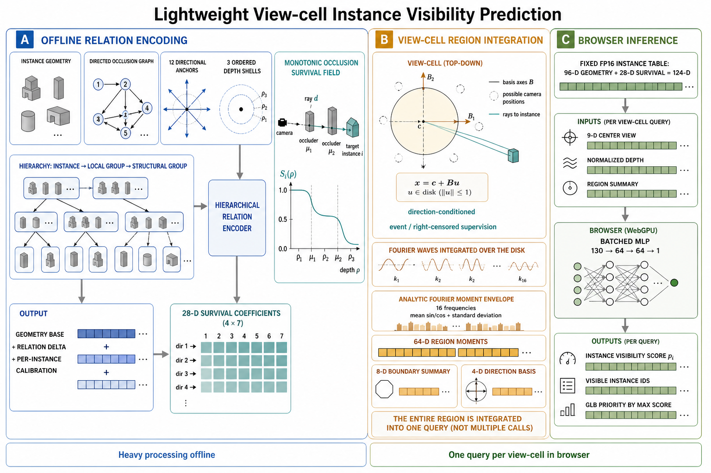

# V4 主线模型与核心消融：方法、实现及结果分析

日期：2026-08-28

## 摘要

本文档以论文“方法与消融实验”章节的写法，说明当前实例可见性预测主线的三个核心组成：分层遮挡关系条件化的逐实例生存场、视点区域矩包络频谱查询，以及面向高召回安全目标的逐 pose 平衡损失。模型的目标是在后退 `66°` 视锥提供的候选实例中，预测同一 view-cell 内可能可见的实例并集；浏览器只执行一次当前 view-cell 查询，不在线展开离线采样使用的多个 subpose。

当前完整模型不包含表征对比损失。其运行时只读取每个实例的 `96` 维几何特征和 `28` 维融合生存系数，并使用当前相机和 view-cell 参数构造轻量查询。分层关系图、真实遮挡边、逐实例校准残差、删失监督和关系一致性监督均在离线训练阶段消化，不进入前端。三种子 validation 消融表明，生存场整体和分层遮挡关系是主要有效模块；视点区域矩包络产生较小但稳定的分类与剔除收益；加权召回保护在冻结安全工作点下主要改善分数边界和有效剔除；困难边界间隔主要改善 balanced accuracy、资源量和分数分布。此前的表征对比项具有稳定负效应，因此被排除在最终完整模型之外。



**图 1.** V4 实例可见性模型的整体架构。蓝色区域表示离线分层关系编码，青色区域展示方向条件化的单调遮挡生存场，橙色区域表示对整个 view-cell 的解析 Fourier 矩积分，绿色区域表示浏览器端固定实例表与批量 MLP 推理。

## 1. 任务定义与模型数据流

对于一个 view-cell 查询，后退相机先生成候选实例集合 $C$，离线 Color-ID 采样得到该 view-cell 内所有合法 subpose 的保守可见并集 $G$。模型对每个候选实例 $i\in C$ 输出连续可见性分数 $p_i$，再由该 checkpoint 自己在 calibration split 上冻结的阈值 $\tau$ 得到预测集合

\[
P=\{i\in C\mid p_i\ge \tau\}.
\]

训练和评价不向 $C$ 补入 GT，也不改变候选生成规则。浏览器运行时只使用当前 view-cell 的中心位置、半径、相机朝向和候选实例，一次批量推理得到该区域内的潜在可见实例并集。

完整数据流可概括为：

```text
离线阶段
96 维实例几何 + train-only 遮挡关系图 + 层次分组
    -> 分层关系编码器
    -> 每实例 4x7 生存先验
    -> 逐实例有界校准残差
    -> 融合为 28 维固定生存系数

浏览器阶段
当前 view-cell + 相机 + 实例 AABB
    -> 9 维中心视角变量和 9x2 区域变化轴
    -> 视点区域 Fourier 矩包络
    -> 方向条件化生存场查询
    -> 轻量共享 MLP
    -> 实例可见性分数
```

运行时固定实例表为 `124` 个 FP16 数值，即 `96` 维几何与 `28` 维生存系数。HKUST 表大小为 `4,670,088` bytes，约 `4.45 MiB`。最终可见性头的输入为 `130` 维，经过两层宽度为 `64` 的共享 MLP 后输出一个 logit。前端不执行图传播、邻居搜索、深度剥离、逐实例多 subpose 推理或在线生存场训练。

## 2. 分层遮挡关系条件生存场

### 2.1 真实遮挡关系的离线表达

普通实例几何只描述“这个实例是什么形状、位于哪里”，不能说明“从哪个方向观察时，谁位于它前方”。因此主线使用 train split 中观测到的有向遮挡关系。每条边从前方遮挡来源实例指向后方目标实例，并附带相对几何、观测置信度、方向区间和深度层信息。

关系空间被划分为 `12` 个球面方向和 `3` 个有序深度层。对目标实例 $i$，来自实例 $j$ 的边首先结合以下信息编码为边消息：

- 来源实例和目标实例各自的几何隐变量；
- 遮挡边的相对几何与证据特征；
- 所属球面方向嵌入；
- 所属深度层嵌入。

同一“目标实例、方向、深度层”单元内的多条边通过带证据置信度的注意力汇聚。三个深度层保持固定的前后顺序输入深度序列网络，得到每个方向上的有序遮挡表征；随后再在方向维执行注意力，恢复每个目标实例的关系表征。这种处理保留了遮挡关系中的方向性和深度顺序，避免用全局 mean/max 聚合抹平“前方”和“后方”的区别。

### 2.2 从实例关系到场景层次

大型场景中的遮挡并不只发生在一对实例之间，还具有局部构件组和建筑结构组的层次。关系编码器因此继续执行两级有界聚合：

1. 实例关系特征在局部组内聚合，形成局部构件组状态；
2. 局部组状态在结构组内聚合，形成更大尺度的结构状态；
3. 每个实例重新读取自己的实例级、局部级和结构级状态。

局部组和结构组均设置最大成员数，避免离线图传播在大场景中无界扩张。最终关系隐藏量同时包含实例自身关系、局部上下文、结构上下文以及是否存在有效遮挡证据的标记。

### 2.3 生存系数的生成与逐实例校准

每个实例的生存场由 `4x7=28` 个系数表示。编码器先从实例几何产生基础系数 $A_i^{geo}$，再从关系上下文产生有界增量 $\Delta A_i^{rel}$ 和四个秩分量的门控 $g_i$：

\[
A_i^{prior}=A_i^{geo}+g_i\odot\Delta A_i^{rel}.
\]

共享关系网络能够利用跨实例的共性，但仅靠共享参数容易抹平少见实例或局部特殊遮挡。因此每个实例还拥有一个从零初始化的 `4x7` 校准残差。残差通过双曲正切限制在有限范围，并按训练日程逐步加入：

\[
A_i=A_i^{prior}+\beta\,4\tanh(R_i/4),
\]

其中 $\beta$ 在训练初期经过 warm-up 和 ramp，从共享先验平滑过渡到逐实例校准。校准正则根据实例训练证据的可靠性约束残差，证据不足的实例不能任意记忆训练标签。导出时 $A_i^{prior}$ 与校准残差直接相加，浏览器只保存最终 $A_i$，不保存图、分组和独立残差。

### 2.4 单调遮挡生存语义

给定当前观察方向，轻量方向网络产生四维方向基 $\phi$。方向基与实例系数相乘得到七个参数：

\[
q_i=\phi(\mathbf v)^T A_i,\qquad q_i\in\mathbb R^7.
\]

七个参数依次解释为无阻挡概率、两个混合权重、两个首遮挡深度和两个尺度：

\[
p_{free}=\sigma(q_0),\quad
(\pi_1,\pi_2)=\operatorname{softmax}(q_1,q_2),
\]

\[
\mu_k=0.05+0.90\sigma(q_{2+k}),\quad
s_k=0.03+\operatorname{softplus}(q_{4+k}).
\]

使用实例半径相对的对数距离并按训练分位数归一化得到深度 $\rho$ 后，首遮挡事件的累计概率和生存概率为

\[
F_i(\rho)=(1-p_{free})\sum_{k=1}^{2}\pi_k
\sigma\!\left(\frac{\rho-\mu_k}{s_k}\right),
\qquad
S_i(\rho)=1-F_i(\rho).
\]

由于每个 Logistic 累积分布随深度单调增加，$S_i$ 随深度单调不增。模型不会学出“同一方向上先被遮挡，距离更远后又恢复可见”的不合理曲线。一次查询输出八个可解释量：生存概率、遮挡概率、无阻挡概率、期望遮挡深度、深度不确定度、两个混合权重和局部斜率。最终可见性仍由共享 MLP 联合几何、区域视角和这些生存语义判断，生存场不是硬编码剔除规则。

### 2.5 生存场的监督

生存场同时接受三类离线监督：

- **删失似然。** 观测到目标前方存在遮挡事件时使用 $-\log(1-S_i)$；尚未观察到遮挡事件时作为右删失样本，使用 $-\log S_i$。样本权重来自 train-only 分层采样的概率修正。
- **关系一致性。** 真实遮挡边与确定性构造的负边进行二分类，同时约束前后深度顺序，并按观测证据置信度排序关系分数。
- **最终可见性梯度。** 28 维系数通过方向查询和最终可见性头接受实例可见标签的端到端梯度。

因此，这 28 维表示不是独立查表，也不是单纯对实例 ID 的记忆，而是“真实遮挡关系先验、单调深度语义和最终可见性任务”共同优化的紧凑表示。

## 3. 视点区域矩包络频谱查询

### 3.1 九维中心视角变量

对每个候选实例，模型先从 view-cell 中心、相机朝向、相机 FOV 和实例 AABB 构造九维视角变量：

1. 相机到实例中心的三维单位方向；
2. 归一化对数距离；
3. 实例方向与相机前向的夹角余弦；
4. 归一化屏幕水平、垂直位置；
5. 实例的水平、垂直角尺度。

这些变量描述了“实例相对当前视角位于哪里、距离多远、在屏幕上有多大”。距离额外通过实例半径归一化，用于生存场的单调深度查询。

### 3.2 用低秩圆盘表示整个 view-cell

运行契约要求模型预测整个水平 view-cell 内的保守可见并集，但浏览器不能为每个 view-cell 展开多个 subpose。主线在中心位置对九维视角变量分别沿世界 $x$ 和 $z$ 方向求一阶变化，得到 `9x2` 矩阵 $B$。对于单位圆盘内的二维坐标 $u$，区域内的视角变量近似为

\[
x(u)=c+Bu,\qquad \|u\|_2\le1,
\]

其中 $c$ 是中心九维变量。矩阵每一行都根据该特征距离 `[-1,1]` 边界的剩余范围进行裁剪，防止投影奇点附近的一阶导数产生无界区域。

### 3.3 Fourier 矩的解析积分

点式 Fourier 编码只计算中心位置的 sin/cos，不能反映 view-cell 内方向变化。主线使用 `16` 个可学习联合频率 $f_m\in\mathbb R^9$，直接计算均匀圆盘上 Fourier 特征的均值和标准差。令

\[
\varphi_m=2\pi f_m^Tc,
\quad
s_m=2\pi\|B^Tf_m\|_2,
\quad
\chi(s)=\frac{2J_1(s)}{s},
\]

则均值具有闭式表达：

\[
\mathbb E[\sin(2\pi f_m^Tx)]=\sin(\varphi_m)\chi(s_m),
\]

\[
\mathbb E[\cos(2\pi f_m^Tx)]=\cos(\varphi_m)\chi(s_m).
\]

二阶矩通过 $\chi(2s_m)$ 计算，从而得到 sin 和 cos 的标准差。每个频率输出 `mean-sin、mean-cos、std-sin、std-cos` 四个值，16 个频率共 `64` 维区域频谱特征。前端通过一个固定的小型分段线性表查询 $\chi$，不需要在线调用 Bessel 特殊函数。

区域频谱再与中心九维变量、`4` 维区域低秩尺度摘要和由实例 28 维系数产生的 `8` 维关系条件结合，压缩为 `8` 维区域边界摘要。该摘要同时参与四维方向基和最终可见性预测。

### 3.4 点查询消融的含义

“去除视点区域矩包络”并不删除视角输入，而是把 $B$ 设为零。此时 $\chi(0)=1$，标准差为零，模型退化为中心位置的点式 Fourier 查询。Full 与该消融的差异因此主要来自“显式建模整个 view-cell 内视角分布”，而不是视角特征是否存在。

## 4. 面向安全工作点的综合可见性损失

当前 Full 已关闭表征对比项。可见性主损失由逐 pose 平衡分类、单侧 weighted-recall 保护和困难边界 logit 间隔组成：

\[
L_{vis}=L_{pose\text{-}bal}
+0.30L_{WR\text{-}guard}
+0.20\alpha(t)L_{tail},
\]

其中 $\alpha(t)$ 在训练前 `15%` 更新中从 0 线性增长到 1。生存删失、关系一致性和逐实例校准正则分别以 `0.25`、`0.10` 和 `0.02` 的权重作为离线表示辅助监督。视觉效用、下载优先级和 GLB 字节预算损失均为零，不参与本轮训练。

### 4.1 逐 pose 平衡分类

数据集中的不同 pose 具有不同候选数和正负比例。若直接把所有候选展平计算 BCE，候选多的 pose 和不可见负例会主导梯度。主线先在每个 pose 内分别计算正类和负类 BCE：正类根据可见权重进行压缩后归一化，负类取均值；再对正负类等权，并在 pose 之间等权平均。

该设计让每个 pose 都拥有相近的优化权重，同时避免大量负例把模型推向“全部不可见”。可见权重只调节正例内部的重要程度，不把普通 pose recall 替换为 weighted recall。

### 4.2 单侧 RVL weighted-recall 保护

召回保护直接使用连续概率估计 soft weighted recall，而不是在训练中选择离散阈值。设重要性归一化后的正例权重为 $w_i$，则

\[
\widetilde R_w=\sum_{i:y_i=1}w_i\sigma(z_i).
\]

损失只对超过允许漏检量 `1-0.99` 的部分施加平滑惩罚。除全批 aggregate 项外，还计算各 pose 的 weighted miss，并对最差 `25%` pose 的 miss 取 CVaR，权重为 `0.25`。它的作用是防止少量容易 pose 掩盖困难 pose，但正式安全门仍由 calibration 冻结阈值后的 validation weighted recall 及其置信下界决定。

### 4.3 困难边界 logit 间隔

普通 BCE 对已经较容易的样本仍持续分配梯度，而高召回工作点真正困难的是低分正例和高分负例之间的尾部重叠。主线在每个 pose 内选择：

- 按可见权重累计质量最低的 `0.5%` 正例，最多 `64` 个；
- 分数最高的 `1%` 负例，最多 `256` 个。

仅当负例分数与正例分数违反 `0.5` logit 间隔时，使用温度为 `0.25` 的 softplus 间隔损失。该项只分离最终 logit，不引入第二个分类器或额外运行时资产。

### 4.4 阈值与训练损失的职责分离

训练损失负责学习正负样本排序和安全余量，最终阈值只由每个 checkpoint 自己的 calibration split 冻结。validation 用于选择配置和 checkpoint，test 不参与阈值选择。阈值是否接近 0.5 只作为分布健康诊断，不能替代 weighted recall 安全门，也不能通过温度或 bias 后处理伪装性能提升。

## 5. 消融设计

所有成员从头训练 `40 epoch x 900 step`，使用种子 `20260801/02/03`，每批包含 `4` 个 pose。数据固定为 `5926 train / 659 calibration / 730 validation / 684 test`；本报告不读取 test。每个 checkpoint 使用自己的 calibration 冻结阈值，所有比较使用相同 validation pose、后退相机候选、GT 和可见权重。

| 变体 | 改动 | 保留内容 | 研究问题 |
|---|---|---|---|
| **Full** | 无 | 全部分层关系、生存场、矩包络和三项可见性损失 | 当前完整参考 |
| 去除分层关系 | 用参数量近似匹配的两层几何 MLP 生成 28 维生存先验 | 单调生存语义、逐实例校准、矩包络和完整损失 | 真实关系图是否优于仅增加共享网络容量 |
| 去除生存场 | 删除 28 维表、方向生存查询及其全部辅助监督 | 96 维几何、区域矩包络和可见性损失 | 生存表示整体是否必要 |
| 通用可训练 28 维 | 每实例随机初始化 28 维可训练参数，只接受最终可见性梯度；取消单调语义和关系/删失监督 | 与 Full 相同的实例表宽度、方向混合和查询输出宽度 | 收益来自结构化遮挡语义，还是额外实例记忆容量 |
| 去除视点区域矩包络 | 区域矩阵 $B=0$，退化为中心点 Fourier 查询 | 分层校准生存场和完整损失 | 显式 view-cell 区域积分是否有效 |
| 去除 RVL 召回保护 | $L_{WR\text{-}guard}$ 权重设为 0 | 架构、逐 pose BCE 和困难边界间隔 | weighted-recall 保护是否改善安全工作点 |
| 去除困难边界间隔 | $L_{tail}$ 权重设为 0 | 架构、逐 pose BCE 和召回保护 | 尾部正负间隔是否改善分离和分布健康 |

其中，“去除分层关系”仍保留逐实例校准，而几何 MLP 参数量与完整关系编码器近似匹配；“通用 28 维”是可训练容量对照，不是冻结随机噪声；“去除生存场”则真正把运行时固定表从 124 维缩减到 96 维。这三者共同区分关系信息、结构化生存语义和额外参数容量的贡献。

## 6. 消融结果

### 6.1 三种子 validation 均值

每个 validation pose 平均包含 `4747.90` 个候选和 `109.02` 个 GT 可见实例。`Pose P/R` 先逐 pose 计算再宏平均；`Agg P/R` 合并全部 pose 的 TP、FP、FN、TN 后计算。`WR` 为 aggregate weighted recall；`LCB` 为三个种子的 validation weighted recall 单侧 95% 下界均值。

| 变体 | Pose P | Pose R | Pose accuracy | Pose balanced accuracy | Agg P | Agg R | WR | LCB | Agg accuracy | Agg balanced accuracy |
|---|---:|---:|---:|---:|---:|---:|---:|---:|---:|---:|
| **Full：无对比损失** | **0.4846** | **0.9772** | **0.9102** | **0.9266** | **0.2135** | **0.9793** | **0.99729** | **0.99535** | **0.9165** | **0.9472** |
| 去除分层关系 | 0.4755 | 0.9737 | 0.8842 | 0.9082 | 0.1544 | 0.9817 | 0.99682 | 0.99396 | 0.8751 | 0.9272 |
| 去除生存场 | 0.3589 | 0.9613 | 0.8491 | 0.8831 | 0.1376 | 0.9589 | 0.99827 | 0.99722 | 0.8530 | 0.9047 |
| 通用可训练 28 维 | 0.4244 | 0.9886 | 0.9026 | 0.9279 | 0.1974 | 0.9884 | 0.99893 | 0.99808 | 0.9071 | 0.9468 |
| 去除视点区域矩包络 | 0.4727 | 0.9775 | 0.9027 | 0.9217 | 0.1963 | 0.9833 | 0.99726 | 0.99552 | 0.9072 | 0.9444 |
| 去除 RVL 加权召回保护 | 0.4221 | 0.9857 | 0.8921 | 0.9191 | 0.1804 | 0.9894 | 0.99807 | 0.99681 | 0.8944 | 0.9408 |
| 去除困难边界间隔 | 0.3980 | 0.9823 | 0.9050 | 0.9279 | 0.2119 | 0.9683 | 0.99870 | 0.99781 | 0.9150 | 0.9410 |

所有变体的三个种子在 validation 的同一冻结阈值下，weighted recall 点估计与单侧 95% 下界均大于 `0.99`；因此可以在相同安全约束下比较分类和剔除效率。Full 三个种子的选中 epoch/阈值为 `32/0.42`、`36/0.68` 和 `40/0.58`。

### 6.2 剔除与资源指标

`Useful cull = TN/candidate`，只计入正确剔除的不可见实例；`bad cull = FN/candidate`，表示错误剔除。两者必须与 recall 和 weighted recall 联合解释。

| 变体 | Useful cull | Bad cull | 平均预测实例 | 预测/候选 | 平均预测 GLB | 预测 GLB 字节/pose | 固定特征表 |
|---|---:|---:|---:|---:|---:|---:|---:|
| **Full：无对比损失** | **0.89397** | **0.000474** | **501.17** | **10.56%** | **183.59** | **41.84 MB** | **4.45 MiB / 124 维** |
| 去除分层关系 | 0.85254 | 0.000419 | 698.12 | 14.70% | 190.80 | 41.47 MB | 4.45 MiB / 124 维 |
| 去除生存场 | 0.83101 | 0.000944 | 797.85 | 16.80% | 207.74 | 40.02 MB | 3.45 MiB / 96 维 |
| 通用可训练 28 维 | 0.88442 | 0.000266 | 547.52 | 11.53% | 208.79 | 54.13 MB | 4.45 MiB / 124 维 |
| 去除视点区域矩包络 | 0.88459 | 0.000383 | 546.14 | 11.50% | 188.39 | 42.51 MB | 4.45 MiB / 124 维 |
| 去除 RVL 加权召回保护 | 0.87169 | 0.000244 | 608.05 | 12.81% | 206.38 | 49.15 MB | 4.45 MiB / 124 维 |
| 去除困难边界间隔 | 0.89278 | 0.000728 | 505.59 | 10.65% | 203.19 | 63.99 MB | 4.45 MiB / 124 维 |

### 6.3 配对分层 bootstrap

统计比较先按 seed 聚类，再在被抽中的 seed 内对相同 pose 重采样，共 `10,000` 次。下表差值定义为 `Full - 消融`；对于分类和 useful cull，正值有利于 Full；对于平均预测数，负值有利于 Full。

| 被移除或替换的模块 | Agg precision 差值 [95% CI] | Accuracy 差值 [95% CI] | Balanced accuracy 差值 [95% CI] | Useful cull 差值 [95% CI] | 平均预测数差值 [95% CI] |
|---|---:|---:|---:|---:|---:|
| 分层关系 | +0.0592 [0.0384, 0.0867] | +0.0414 [0.0235, 0.0637] | +0.0200 [0.0155, 0.0253] | +0.0414 [0.0232, 0.0643] | -196.95 [-307.25, -108.01] |
| 生存场 | +0.0759 [0.0493, 0.0951] | +0.0634 [0.0223, 0.0941] | +0.0424 [0.0363, 0.0492] | +0.0630 [0.0209, 0.0942] | -296.68 [-450.18, -91.64] |
| 结构化生存场改为通用 28 维 | +0.0162 [0.0031, 0.0261] | +0.0093 [0.0017, 0.0155] | +0.0004 [-0.0027, 0.0030] | +0.0096 [0.0017, 0.0158] | -46.35 [-76.90, -8.35] |
| 视点区域矩包络 | +0.0172 [0.0074, 0.0328] | +0.0093 [0.0042, 0.0169] | +0.0028 [0.0007, 0.0059] | +0.0094 [0.0042, 0.0171] | -44.97 [-82.11, -19.99] |
| RVL 加权召回保护 | +0.0331 [0.0081, 0.0759] | +0.0220 [0.0046, 0.0508] | +0.0064 [0.0002, 0.0157] | +0.0223 [0.0046, 0.0512] | -106.88 [-244.86, -22.01] |
| 困难边界间隔 | +0.0016 [-0.0348, 0.0422] | +0.0014 [-0.0164, 0.0234] | +0.0061 [0.0023, 0.0101] | +0.0012 [-0.0170, 0.0237] | -4.42 [-112.94, 83.67] |

## 7. 各模块作用分析

### 7.1 生存场是主要性能来源

Full 相对无生存场的 aggregate precision 提高 `7.59` 个百分点，accuracy 提高 `6.34` 个百分点，balanced accuracy 提高 `4.24` 个百分点，useful cull 提高 `6.30` 个百分点，平均少预测约 `297` 个实例，所有这些置信区间均不跨零。该结果说明仅靠固定几何和视角查询不足以恢复遮挡状态；把“沿方向随深度发生首遮挡的概率”编码为逐实例单调场，对大候选集合中的正负分离具有实质作用。

无生存场将固定表从 `4.45 MiB` 降到 `3.45 MiB`，节省约 `1 MiB`，但平均预测实例从 `501` 增至 `798`。对于前端而言，这一资产节省会换来更多实例显示、解析和渲染负担，因此当前数据不支持删除生存场。

### 7.2 分层关系不是普通网络容量带来的假收益

“去除分层关系”使用参数量近似匹配的几何 MLP，并保留相同 28 维生存语义和逐实例校准。Full 仍在 precision、accuracy、balanced accuracy、useful cull 和预测数量上稳定占优，说明收益来自真实遮挡边、方向/深度结构和层次上下文，而不只是增加了网络参数。

Full 与无关系成员的 weighted recall 和 bad cull 差值均跨零。这意味着分层关系主要减少 false positive、提升不可见实例识别和剔除效率，没有通过增加漏检换取结果。该模块是目前最适合作为论文核心贡献的部分之一。

### 7.3 结构化生存语义优于同容量实例记忆，但存在安全余量权衡

通用 28 维对照拥有相同实例表宽度，并可通过最终可见性标签端到端训练。Full 相对该对照仍提高 aggregate precision `1.62` 个百分点、accuracy `0.93` 个百分点、useful cull `0.96` 个百分点，并平均少预测 `46` 个实例；相应置信区间不跨零。这证明生存场的单调深度参数化、遮挡关系和删失监督提供了超出实例 ID 记忆的结构化归纳偏置。

该结论需要同时报告代价：Full 的 aggregate recall 比通用 28 维低 `0.0091`，weighted recall 低 `0.00164`，bad cull 高 `0.000208`，这些差异的区间不跨零。两者均通过安全门，但通用 28 维保留了更大召回余量。论文中应表述为“在满足预注册 weighted-recall 安全门的前提下提高分类与剔除效率”，不能表述为所有安全指标同时改善。

### 7.4 视点区域矩包络提供小而稳定的区域建模收益

Full 相对中心点查询的 aggregate precision 提高 `1.72` 个百分点，accuracy 提高 `0.93` 个百分点，balanced accuracy 提高 `0.28` 个百分点，useful cull 提高 `0.94` 个百分点，平均少预测约 `45` 个实例，均具有不跨零的置信区间。说明 view-cell 内视角变化不能完全由中心视角代替，解析 Fourier 矩能够提供额外信息。

Full 的普通 aggregate recall 低 `0.0040`、bad cull 高 `0.000091`，但 weighted recall 差值跨零。矩包络的作用应解释为在重要可见实例安全性基本不变时改善边界与剔除，而不是提升普通召回。由于它只增加固定频率查询、查表和小型融合头，不需要多 subpose 推理，其系统代价明显小于在线采样整个 view-cell。

### 7.5 RVL 保护改善安全工作点下的可分性，而非直接抬高最终召回

加入 RVL 保护后，Full 相对无保护成员的 precision、accuracy、balanced accuracy 和 useful cull 均稳定提高，平均少预测约 `107` 个实例，预测 GLB 字节少约 `7.31 MB/pose`。但 Full 的普通 aggregate recall 低 `0.0100`，weighted recall 差值跨零。

这一现象来自训练目标与工作点选择的共同作用：召回保护在训练期维持重要正例的连续概率余量，而每个模型在 calibration 上独立选择满足安全门的阈值。最终比较的是各自安全阈值下能剔除多少负例，不是固定阈值下谁的 recall 更高。因此本轮结果支持“RVL 保护改善安全工作点下的边界质量和剔除效率”，不支持“RVL 一定提高最终 weighted recall”的更强结论。

### 7.6 困难边界间隔主要改善分布健康和资源映射

去除困难边界后，precision、accuracy、useful cull 和平均预测数差异均跨零，说明其普通实例分类贡献不稳定；Full 的 balanced accuracy 提高 `0.61` 个百分点，置信区间不跨零。与此同时，Full 的平均预测 GLB 字节少约 `22.15 MB/pose`，并把三个种子的安全阈值从 `0.05-0.15` 提高到 `0.42-0.68`。

较高且稳定的安全阈值表明正负分数尾部的绝对位置更健康，但阈值可被 bias 或温度改变，不能单独证明性能。GLB 字节差异还受到实例到 GLB 的分组和资源大小影响，仍只能作为资源诊断。完整模型的硬件 Color-ID 评价已经完成，但没有对该损失消融单独重复图像渲染，因此当前证据支持保留该项作为辅助优化，不足以把它单独包装成最主要的图像质量贡献。

### 7.7 表征对比项消融

含表征对比项的 Full 把困难低分正例拉向正类原型，并推离高分负例。该目标假设可见正例在隐藏空间中应形成紧凑类簇，但实例可见性由几何、遮挡关系、观察方向和深度共同决定，同一“可见”标签可能对应完全不同的几何条件。强制类内聚类会压缩对最终边界有用的连续结构。

实验证实，含表征对比项的 Full 相对当前 Full 的 aggregate precision 下降 `0.01554`，accuracy 下降 `0.00819`，balanced accuracy 下降 `0.00356`，useful cull 下降 `0.00822`，并多预测 `39.17` 个实例；这些区间均不跨零，weighted recall 差值跨零。当前模型因此只保留同一困难样本集合上的 logit 间隔。

## 8. 总体结论与论文表述边界

本轮消融支持三个层级的结论。

第一，**分层遮挡关系条件化的逐实例生存场是主要有效创新**。完整生存场相对完全移除具有最大收益；真实关系图相对容量匹配几何网络也具有稳定收益；结构化生存场相对同容量实例记忆仍有优势。这组三层对照共同排除了“仅仅增加参数或实例查表容量”的解释。

第二，**视点区域矩包络是有效的轻量区域查询机制**。它避免浏览器展开多个 subpose，在较小前端代价下产生稳定的 precision、accuracy 和 useful-cull 增益。其作用量小于生存场和分层关系，但实现路径清晰，符合 view-cell 保守预测的运行契约。

第三，**综合损失中最可靠的基础是逐 pose 平衡分类与单侧 weighted-recall 保护**。召回保护在独立 calibration 阈值下表现为更好的安全工作点效率；困难边界间隔主要改善 balanced accuracy、资源映射和分布健康。表征对比损失则已被正式否定，不应作为论文贡献。

论文主张必须限定在 validation 证据覆盖的范围内。当前可以声称各结构在 weighted-recall 安全门内改善实例分类和有效剔除；完整模型在 HKUST 和 IFCBench 的硬件 Color-ID validation 评价中分别得到 `0.3247%` 和 `0.0545%` aggregate PER。由于尚未对全部消融成员做配对图像渲染，不能把这两个绝对结果解释为某一模块稳定改善图像质量。GLB 字节结果是基于当前实例分数聚合的资源诊断，不是独立下载头的训练贡献。

## 9. 复现与验证状态

正式机器结果位于：

```text
neural_instance_culling/benchmark/out/pvs_v4_integrated_visibility_mainline_v1/paper_core_ablation_summary.json
```

汇总使用相同的 730 个 validation pose、三种子和 10,000 次配对分层 bootstrap。汇总器验证逐 pose 候选实例编号一致、指标有限、每个成员使用自己的 calibration 阈值且 `testRead=false`。对应单元测试已通过。

硬件 Color-ID 图像指标已经回填，见 [`pvs_mainline_image_evaluation_2026-09-09.md`](pvs_mainline_image_evaluation_2026-09-09.md)。浏览器 NVIDIA/Vulkan WebGPU 与真实移动设备前向耗时也已完成实测，但端到端首屏时间、完整调度开销和逐消融图像评价仍未完成；这些缺口不影响本报告的实例分类消融结论，但仍限制系统收益和模块级图像收益的最终论文表述。
